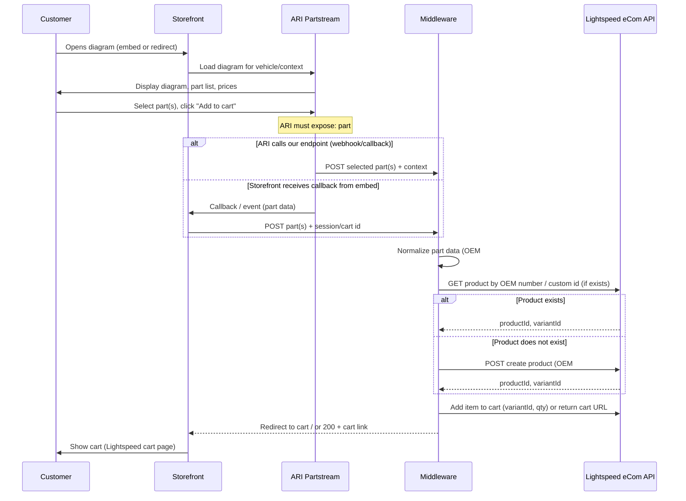

# Technical Architecture — Lightspeed eCom Powersports + ARI Partstream

**Project:** UMS — Powersports Online Store  
**Last updated:** 2025-02-26

This document describes the technical architecture for a dual-path storefront: **Parts, Accessories & Apparel** (transactional, unified cart) and **Vehicles** (inventory + lead gen). It covers system boundaries, integration points, and data flows.

---

## 1. High-Level System Overview

```
┌─────────────────────────────────────────────────────────────────────────────────┐
│                              CUSTOMER TOUCHPOINTS                                │
├─────────────────────────────────────────────────────────────────────────────────┤
│  Shop Parts, Accessories & Apparel        │  Shop Vehicles                       │
│  • Category browse                        │  • Inventory browse (iframe)          │
│  • Vehicle selector / My Garage           │  • Lead capture / CRM                │
│  • Diagram lookup (ARI)                   │  • Credit application                │
│  • Keyword search                         │  • Trade-in / financing content      │
│  • Checkout (Lightspeed cart)             │  • No cart — CTA-driven              │
└───────────────────────┬───────────────────┴───────────────────┬─────────────────┘
                        │                                       │
                        ▼                                       ▼
┌─────────────────────────────────────────────────────────────────────────────────┐
│                         FRONT END (Storefront Layer)                             │
│  • Lightspeed eCom theme and/or headless (Next/React)                            │
│  • Embeds: ARI Partstream (diagrams), Dealer Spike (inventory iframe)            │
└───────────────────────┬───────────────────────────────────────┬─────────────────┘
                        │                                       │
        ┌───────────────┼───────────────┐                       │
        ▼               ▼               ▼                       ▼
┌───────────────┐ ┌───────────────┐ ┌───────────────────┐ ┌─────────────────────┐
│ Lightspeed    │ │ ARI           │ │ Middleware /      │ │ Vehicle & Fitment   │
│ eCom API      │ │ Partstream    │ │ Headless Back end │ │ Service (optional)  │
│               │ │ (diagrams)    │ │                   │ │                     │
│ • Products    │ │ • OEM diagrams│ │ • Diagram → cart  │ │ • Y/M/M hierarchy   │
│ • Cart        │ │ • Part select│ │ • Create SKU      │ │ • Fitment rules     │
│ • Checkout    │ │ • Pricing?   │ │ • Add to cart     │ │ • My Garage store   │
│ • Orders      │ │ • Fitment?   │ │ • Auth / session  │ │                     │
└───────────────┘ └───────────────┘ └───────────────────┘ └─────────────────────┘
```

**Design principle:** One cart (Lightspeed). Parts from catalog and from ARI diagrams both become Lightspeed line items. Vehicles path does not use the cart.

---

## 2. Component Responsibilities

| Component | Role | Key APIs / Interfaces |
|-----------|------|------------------------|
| **Lightspeed eCom** | Catalog, cart, checkout, orders, customer accounts. Source of truth for all sellable SKUs (including OEM parts created on demand). | REST API (products, variants, cart, orders). Webhooks optional. |
| **ARI Partstream** | Interactive OEM parts diagrams. Customer selects parts; we need part number, description, price, vehicle context (Y/M/M), manufacturer. | TBD — embed + JavaScript callbacks and/or server API. Must confirm with ARI. |
| **Middleware / Back end** | Receives “add from diagram” events; creates or finds product in Lightspeed; adds to cart; returns cart URL or session. Optionally handles vehicle/fitment if not in Lightspeed. | Small API (Node/Next serverless or standalone service). Calls Lightspeed API; may call ARI or receive from front end. |
| **Vehicle & Fitment Service** | Optional. Stores vehicle hierarchy (Type, Year, Make, Model) and product–vehicle fitment. Used for filtering and “My Garage.” Can live in Lightspeed custom fields instead. | REST or GraphQL; or Lightspeed metafields/custom attributes only. |
| **Dealer Spike (or similar)** | Vehicle inventory and listing pages. Embedded via iframe. No direct API dependency for core architecture. | iframe embed; lead/CRM forms as provided by vendor. |

---

## 3. Data Flow: Add from Diagram to Cart (Parts Funnel)

This is the critical path that unifies ARI diagram parts with the Lightspeed cart.



**Assumptions to confirm with ARI:**

- How “Add to cart” is exposed: server callback, client-side event, or redirect with query params.
- Whether ARI sends **price** and **vehicle (Year/Make/Model)** so we can create accurate SKUs and fitment.

**Middleware responsibilities:**

1. Accept part payload (from ARI or storefront).
2. Idempotent “find or create” product in Lightspeed (e.g. by OEM part number or external ID).
3. Attach fitment (vehicle type and/or Y/M/M) via Lightspeed custom fields or metafields.
4. Add variant to Lightspeed cart (existing cart ID or session-based).
5. Return redirect URL to Lightspeed cart or return cart deep link.

---

## 4. Data Flow: Vehicle Funnel (Lead Gen, No Cart)

Vehicles are not sold through the same cart; the goal is inventory visibility and lead capture.

```
┌─────────────┐     ┌─────────────────────┐     ┌──────────────────────┐
│  Customer   │────▶│  Storefront         │────▶│  Dealer Spike        │
│             │     │  (Vehicle section)   │     │  (iframe inventory)  │
└─────────────┘     └──────────┬──────────┘     └──────────────────────┘
                               │
                               │  CTA: Credit app / Contact / Trade-in
                               ▼
               ┌─────────────────────────────────────┐
               │  Lead capture / CRM / Forms         │
               │  • Lightspeed form or 3rd party     │
               │  • Credit application provider      │
               │  • No Lightspeed cart involvement   │
               └─────────────────────────────────────┘
```

- **No product or cart API** used for the vehicle path.
- Storefront only needs: vehicle section pages, iframe embed, and CTAs that post to your chosen CRM/credit/trade-in endpoints.

---

## 5. Vehicle Data Model & Fitment (Reference)

Conceptually, the system uses:

- **Vehicle hierarchy:** Vehicle Type → Year → Make → Model (optional: Trim).
- **Fitment on products:**  
  - **Non-vehicle specific** — universal (e.g. oil, helmets).  
  - **Type specific** — e.g. “Dirtbike” tires.  
  - **Vehicle specific** — one or more Year/Make/Model (and optional trim).

Diagram-origin parts get their vehicle relationship from ARI context when we create the Lightspeed product. Catalog parts get fitment via admin (Lightspeed custom fields or Vehicle Service).

**Full schema (fields, options, filtering logic):** [Vehicle Data Model & Fitment Schema](vehicle-fitment-schema.md).

---

## 6. Deployment Topology (Conceptual)

```
                    ┌─────────────────────────────────────────┐
                    │           Internet / CDN                 │
                    └────────────────────┬────────────────────┘
                                         │
         ┌──────────────────────────────┼──────────────────────────────┐
         │                              │                              │
         ▼                              ▼                              ▼
┌─────────────────┐          ┌─────────────────┐          ┌─────────────────┐
│ Lightspeed      │          │ Your Middleware  │          │ ARI Partstream   │
│ (hosted eCom)   │          │ (e.g. Vercel/    │          │ (hosted)         │
│                 │          │  AWS/Node)       │          │                  │
└────────┬────────┘          └────────┬────────┘          └─────────────────┘
         │                             │
         │    REST (products, cart)    │
         └─────────────────────────────┘
```

- **Lightspeed:** Hosted; we use API only.  
- **Middleware:** Your infrastructure (e.g. serverless or small Node/Next app).  
- **ARI:** Hosted by ARI; we consume embed and/or API/callbacks.  
- **Vehicle/Fitment:** Either inside Lightspeed (custom data) or in the same middleware/back end with a small DB.

---

## 7. Risk & Dependency Summary

| Risk | Mitigation |
|------|------------|
| ARI does not expose part data or price on “Add to cart” | Confirm with ARI early; if not available, consider fallback (e.g. manual catalog sync or different ARI product). |
| Lightspeed rate limits on product create | Cache “already created” OEM SKUs; use idempotent create-by-external-id to avoid duplicates. |
| Cart session (guest vs. logged-in) | Design middleware to accept Lightspeed cart ID or session identifier so add-to-cart works for both. |
| Vehicle data ownership | Decide: Lightspeed-only vs. external Vehicle Service; document in next (schema) doc. |

---

## 8. Next Steps

1. **Confirm ARI Partstream** integration contract (add-to-cart event payload, pricing, vehicle context).  
2. **Vehicle + fitment schema** — done. See [Vehicle Data Model & Fitment Schema](vehicle-fitment-schema.md); choose Option A (Lightspeed-only) or Option B (Vehicle Service).  
3. **Choose stack:** Lightspeed theme + middleware vs. headless + same middleware. See [Stack Decision](stack-decision.md).  
4. **Implement first slice:** “Add from diagram” → middleware → create product in Lightspeed → add to cart → redirect to cart.

---

*This document is the single source for technical architecture. The vehicle/fitment data model and field-level schema are in [vehicle-fitment-schema.md](vehicle-fitment-schema.md).*
